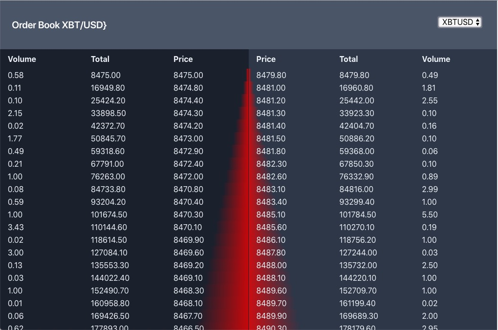

# Notes

- 3 column
- Roughly 25 Bids/Asks

# Strategy

1. Basic folder structure and project dependencies
2. Get a data query working w/ axios
3. Build out initial component hierarchy
4. local data import
5. Get a test working
6. Figure it out

